Running QMD as a containerized MCP server with dual-mode communication (**stdio** for local agents like Claude Code and **HTTP** for remote or web-based agents) is a highly efficient architecture. It isolates the environment (Bun, SQLite, GGUF models) and ensures consistency across different machines.

Here is how you can adapt the PRD and architecture to support this containerized, dual-mode deployment.

---

### 1. Updated Architecture (Containerized)

The container acts as a "Sidecar" knowledge engine. You map your central knowledge folder and the QMD cache (for models and index) to persistent volumes.

```mermaid
graph TD
    subgraph "Host Machine"
        subgraph "Volumes"
            KB_Folder["📂 Local Markdown Files\n(/home/user/kb)"]
            Cache_Folder["📦 QMD Cache & Models\n(~/.cache/qmd)"]
        end

        subgraph "Docker Container (QMD)"
            Runtime["Bun Runtime"]
            Router["MCP Router"]
            
            subgraph "Interfaces"
                STDIO["STDIO Interface\n(For Claude Code)"]
                HTTP["HTTP Server (SSE)\n(For Cursor/Remote Agents)"]
            end
            
            Engine["QMD Search & Ingest Engine"]
            Engine <--> SQLite[(SQLite DB)]
        end

        Agent1["🤖 Claude Code"] <-->|exec docker run -i| STDIO
        Agent2["🌐 Web/Remote Agent"] <-->|JSON-RPC via SSE| HTTP
    end

    %% Volume Mappings
    KB_Folder ---|Mount: /app/kb| Engine
    Cache_Folder ---|Mount: /root/.cache/qmd| Engine
```



---

### 2. Implementation Strategy

To support this, your container needs a specialized entrypoint that can switch modes based on environment variables or flags.

#### A. The Dockerfile
```dockerfile
FROM oven/bun:latest

# Install sqlite3 for fts5/extension support
RUN apt-get update && apt-get install -y sqlite3 libsqlite3-dev

WORKDIR /app
COPY . .
RUN bun install

# Persist models and database
VOLUME ["/root/.cache/qmd", "/app/kb"]

# Default to MCP stdio mode
ENTRYPOINT ["bun", "src/qmd.ts"]
CMD ["mcp"]
```

#### B. The Dual-Mode Logic
You would modify the entrypoint logic in your code to handle an `http` command or an `MCP_TRANSPORT` environment variable:

1.  **STDIO Mode:** Uses `@modelcontextprotocol/sdk/server/stdio.js`. Best for **Claude Code** because it manages the lifecycle of the container as a process.
2.  **HTTP (SSE) Mode:** Uses `@modelcontextprotocol/sdk/server/sse.js`. Best for **Cursor** or **persistent agent workflows** where the server runs in the background.

---

### 3. Revised User Stories (Containerized)

#### Story 1: The "Portable Knowledge" Setup
**As a** user who works on both a Mac and a Linux workstation,
**I want** to pull a single Docker image and map my `Notes/` folder,
**So that** I don't have to worry about installing Bun, SQLite extensions, or local LLM dependencies on every machine.

#### Story 2: The "Remote Agent" Query
**As a** user using a browser-based AI agent,
**I want** to query my local notes via an HTTP/SSE endpoint,
**So that** my agent can access my local private knowledge even if the agent isn't running on my specific hardware.

---

### 4. Updated PRD Specifications

#### 4.1 Interface Requirements
*   **Transport - STDIO:** Active when command is `qmd mcp`. The agent starts the container via `docker run -i ...`.
*   **Transport - HTTP/SSE:** Active when command is `qmd mcp --transport http --port 3000`. The container runs as a background service (`docker run -d`).

#### 4.2 Resource Mapping (Volumes)
*   **Source Folder:** `/app/kb` (Mapped to your local central folder).
*   **Index & Models:** `/root/.cache/qmd` (Mapped to a local cache to prevent re-downloading 2GB of models every time the container restarts).

#### 4.3 Claude Code Configuration (Container Mode)
To use the containerized version with Claude Code, you would update your `settings.json` to call Docker:

```json
{
  "mcpServers": {
    "qmd-container": {
      "command": "docker",
      "args": [
        "run", 
        "-i", 
        "--rm",
        "-v", "/Users/yourname/Knowledge_Base:/app/kb",
        "-v", "/Users/yourname/.cache/qmd:/root/.cache/qmd",
        "qmd-image", 
        "mcp"
      ]
    }
  }
}
```

---

### 5. Pros/Cons of this approach

| Feature | Container + STDIO | Container + HTTP/SSE |
| :--- | :--- | :--- |
| **Agent Match** | **Claude Code**, Claude Desktop | Cursor, Windsurf, Custom Web UI |
| **Setup Complexity** | High (Docker commands in JSON) | Medium (Server must be "Always On") |
| **Latency** | Low (Direct pipe) | Medium (Network overhead) |
| **Ingestion Pipeline** | Triggered by Agent Tool Call | Triggered by Agent Tool Call or Webhook |

### 6. Recommendation for Ingestion
Since you want an "endpoint for the ingestion pipeline," the **HTTP/SSE mode** is superior for ingestion. You can have a simple `POST /ingest` endpoint in the container (or use the MCP Tool `qmd_update_index`) that a GitHub Action or a local file-watcher (like `fswatch`) can hit whenever you save a file in your central folder.